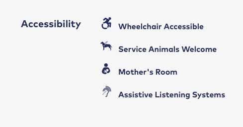
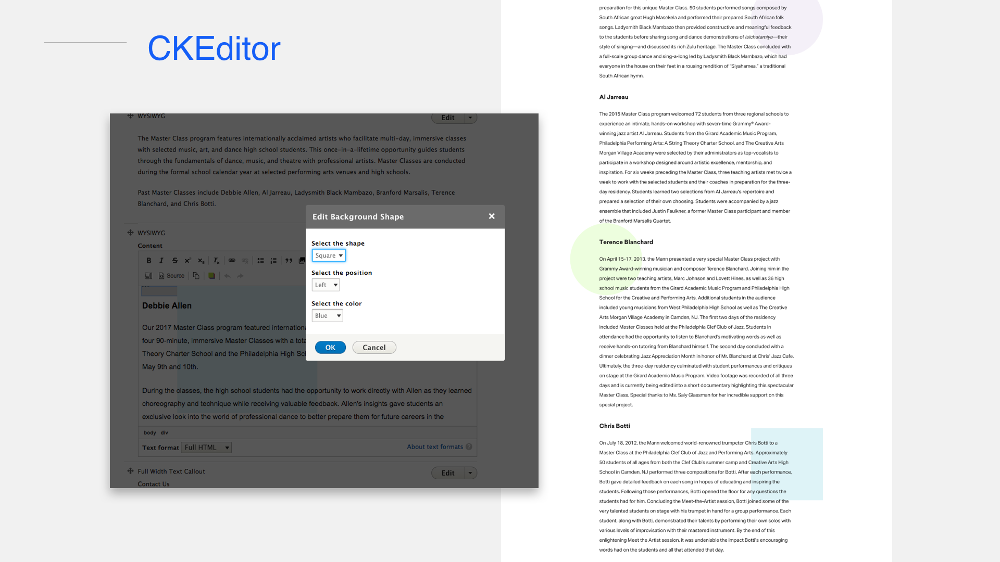

autoscale: true
build-lists: true
slidenumbers: true

# Drupal 8 - The missing Parts

---

# Who am I?

##<br>

## Pete Inge

###Senior Developer, Bluecadet

pinge@bluecadet.com
https://github.com/pingevt/d8-missing-parts


[BC Logo]


^ Experience: ~10yrs freelance in web dev
Worked in D5-D8
Current: @ BC for 2.5 years
Contact for more info

---

# What we’ll cover

- Grabbag of ideas
- methodologies
- and hopefully some best practices

^ Not as much exact code but more ideas you can hopefully google later and learn more in depth.
- I do have some links if you download this presentation.

---

# Who is this for?

- "Site Builders"
- Beginner Coders
- Anyone iterested in getting better at Drupal

^ Get “Site Builders” into code
Beginner Code monkeys
Developers who want to improve the Admin or config side of Drupal
Anyone interested in trying to take their work to the next level

---

# Where I'm coming from (What drives me to do what i do)

- Customization is key to taking your site to the next level
- Drupal is very data centric, and can be very confusing to Content Authors

---

#Where I'm coming from (What drives me to do what i do)

- Let’s try to do it closer to the “Drupal” way
- “In Drupal there are 10 ways to do something and 5 of them are correct”

  - By doing it the “Drupal way”, makes it easier to debug
  - Mental checklist of what to look at when debugging

^ I believe Drupal 8 has gottten better, but still...

---

# Where I'm coming from (What drives me to do what i do)

- We should always be thinking about the next developer.

^ I look at my own code that is 6 months old, and usually can’t believe how or why I did what I did. This is due to a number of factors, typically revolving around time. Just think how crazy it may look to someone else.

---

# Data-centric appoach

- Input Raw Data
- Transform the Data
- Present to our Audience (html/css/js)

^ Data centric appoach:
- With a CMS we really deal with Data first.
- We transform the data for what we need,
- then present it to our audience.
<br >
So Lets dive in!

---

[.footer: https://www.drupal.org/docs/8/creating-custom-modules/adding-stylesheets-css-and-javascript-js-to-a-drupal-8-module]
[.build-lists: false]

##Libraries
####Adding stylesheets and JS to your sites

- Include custom CSS/JS for specific elements
- Helps with optimizations, file size etc.


^ I won't spend too much time on this, but this is the way in D8 to add your custom JS and CSS to your site.
- What is nice is you can define multiple libraries so you only add what you need for certain elements.
<br>
Example: We have multi value fields we use as slide shows. We use flickity for our slideshows. So we have the default flickity JS and CSS and then we have our own custom JS and CSS all included in a library on our theme. We attach this library to the field render array and these files are only loaded when needed.

---

##Preprocess/Alter Functions


- They are all over the place, anything you can theme
- A lot of customization and logic
- I often bury a lot of code here that can be done other ways, but easier here.
- Remove logic from template files
  - Templates should be for presentation, not logic

^Difference between preprocess and alter funcs:
- alters you are typically altering data structures
- preprocess you are typically creating or modifying variables to use in templates

---

##Preprocess/Alter Functions (con't)

Examples

- Links with icons added in
- 'Override' fields
- Add custom dynamic markup

^ Quick basic examples for beginners...
- Mann
- Short Title
- Insert google maps
<br >
Let's get another Step deeper...

---

##Display Formatters


What is a Display Formatter?

^ What is a Display formatter?
In essence,
its taking our data,
manipulating it,
and then creating new data to theme (Sometimes done together)

^ Example: Link Field
- field includes url, link text, target
- Default display as link or seperate link and text

---

##Display Formatters (con't)


Why use a Display Formatter?

- It's the "Drupal" Way
- Re-usability
- Debugging

^-It's the "Drupal" Way: non-coders can see this in the GUI
- Re-usability: use across multiple fields
- Debugging: Typical thing to look for when debugging

---

##Display Formatters (con't)


Re-use and learn from core modules

^A lot of times I just want to tweak one small thing, extend from core
Copy cores and modify to your heart’s content
Most of this could be done in a preprocess, but now I don't have to inturupt Drupal's flow, I can be a part of it.
- *And we do have display formatter Settings

^Examples:
IVC - Accessibility Fields
IVC - Pricing (simple)
Mann - Viewsreference Preview (more complex)

---

##Display Formatters (ex)




^Examples:
12 Accessibility Fields
Alt, logic in a preprocess, interupt drupal flow...
<br>
Time to get a lot more complicated

---

[.footer: https://www.drupal.org/docs/8/api/services-and-dependency-injection/services-and-dependency-injection-in-drupal-8]
##Services

What is a Service

- In Drupal 8 speak, a service is any object managed by the services container.
- OOP for the win!

ANALOGY???

^ What? That explains a whole lot. If you re-use code, or doing the same thing over and over, look at using a service.
Basically going to create a class to re-use your code. OOP for the win!
<br>
That was a little abstract, lets move on to something more tangible

---

##Tokens


- Expose your data however you want to
- REALLY Easy

^ Create your own to expose data in an unlimited way
REALLY Easy
Metatags and URL aliases are probably most common.

---

##Tokens (con't)

```php
/**
 * Implements hook_token_info().
 */
function hook_token_info() {
  // Define your token.
}

/**
 * Implements hook_tokens().
 */
function hook_tokens($type, $tokens,
array $data, array $options, BubbleableMetadata $bubbleable_metadata) {
  // Code to replace your tokens
}
```

^Examples:
Path aliases
Meta Tags (A lot)
“Override” fields (Display title)
When you data gets complex, tokens can help simplify

---

#Content
and helping your site Authors

^We now have few more things in our tool belt. Lets talk about some specific methodology and how we combine these tools.

---

##Options Fields
and preprocess!

<br>

- Basically, fields that define layout/content, but don't actually show on the FE

^We use these mainly with Paragraphs to accomodate an easier admin solution.

---

##Options Fields Ex.


^Presented with these designs. Looked for commonality

---

##Options Fields Ex.


- define color theme
- define Image alignment
- define Image shape
- define background shape (hidden|circle|square)
- define background message

^96 options to display this...
Allow for an easier author experience
There is one place to add content, and then can tweak settings
I have done it and I've seen it done where these would all be different para bundles
<br>
*Going back to data centric, your forms don't have to exaclty mimic your FE deisgn/experience.
<br>
One more step further...

---

##Settings Pages
and preprocess!

^ We now extrapolate that further...
What we previously did was on the paragraph (node) level

---

##Settings Pages


- Most content here was global (but editable)
- Most content was allowed/disallowed for an event
- These were simple bools, and I didn't want to bake into field config

^Context: Event Detail page telling attendees what they can expect at the show. Different types of shows allow different things.
<br>
- Content Authors have the ability to manage things at a global level rather than having to update content in numerous places
- ??
- Keeps content out of configuration (save as Drupal state)
<br>
ex. Picinics...
<br>
Potentially could be blocks or something similar, but I believe this is much simpler implementation

---

##Form States


^ Think (Contextual Fields in D7)

---

##Form States (con't)

Clean up your forms
Lead content Authors through the data

^ Think (Contextual Fields in D7)

---

##Custom Snippets

DO I NEED THIS??????

- Blocks
- Themes
- Forms

^

---

##CKEditor Plugins

- Clients always want more functionality in the WYSIWYG
  - Our typical response is NO
  - but really?
- Con: have to learn new system
- Overall improves Admin experience

^ Our typical response is NO

---

##CKEditor Plugins (ex)



^ We had this design pattern we didn't know how to implement.
Great pattern for a typical boring page.

---

[.footer: https://api.drupal.org/api/drupal/core%21includes%21form.inc/group/batch/8.2.x]

##Custom Batch Processes

- Simple Migrations or content uupdates
- Prebuild Image styles (or whatever assets) for something else
- combine with cron jobs to run large tasks as needed

^Typically used in Dev, for "quick updates"
NASM: updating collections

---

#Extras:

- Build your own Blocks
- Build your own Forms
- Batch API
- Cron Jobs

---

# Custom Code vs. Contrib Module

- Pros
  - Simplify everything (code/config)
  - Potentially reduce crud for content authors

^Sometimes a module just has too many options/config/settings. Do it yourself, but be careful.

---

# Custom Code vs. Contrib Module

- Cons
  - Updates
  - Do you really know enough to do it yourself?

---

## Custom Code vs. Contrib Module (Ex)

### Save & Edit module

- Creates a "Save & Edit" button on node pages
- Provides a number of options to configure that

<br>

- Overall great module :thumbsup:

^What is it?

---

## Custom Code vs. Contrib Module (Ex)

### Save & Edit module

- Adds 2 permissions
- Adds 1 config file
- 11 files to the module

<br>

- Prob 20-30 lines or less of custom code

^I had it enabled and working fine so I kept it.

---

Links:

https://www.drupal.org/docs/8/creating-custom-modules/adding-stylesheets-css-and-javascript-js-to-a-drupal-8-module
https://www.drupal.org/docs/8/api/services-and-dependency-injection/services-and-dependency-injection-in-drupal-8
https://api.drupal.org/api/drupal/core!core.api.php/group/extending/8.2.x
https://www.drupal.org/docs/8/creating-custom-modules
https://api.drupal.org/api/drupal/core%21includes%21form.inc/group/batch/8.2.x

---

#Thanks!
###Questions?